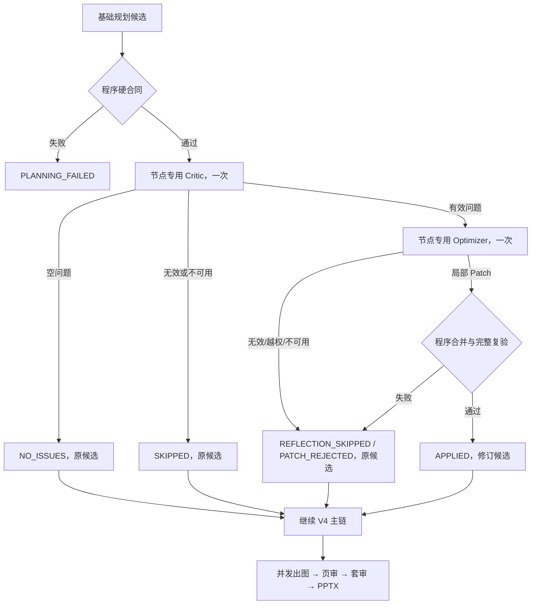

# PPT Agent V4 反射子系统重构实施计划

- 状态：实现与两轮独立审查已完成；无 BLOCKER/MUST_FIX；本地全量门禁通过，尚未提交或部署
- 日期：2026-08-03
- 目标版本：PPT Agent `4.1.1`，内部编译器 `visual-deck-v4-chain-3`
- 范围：仅 `/srv/codex-workspace/PPT-Agent`
- 事实基线：`main@0d078c35bb0fbc2e1e74e8f4fe8766d7fe3b78ed`
- 开发现场：`codex/v4-delivery-reflection` 含尚未提交的 chain-2 生命周期、并发批次、账务、交付和修订补丁改动；不得回滚
- 真实失败证据：c4 Run `run-f9044d35b9be38e80fef9371c651`

> 本计划不建设“万能反射框架”。统一的是边界原则：**硬规则由程序验证；模糊质量可选反射；局部修改后再做程序验证。**

## 1. 目标与结论

c4 已持久化有效的 Source/Spec、Deck/Visual 和 Slide Brief 候选，但旧
`reflect-slide-briefs` 让模型同时返回审查、决策、哈希、完整页面视觉字段和审计元数据。五次 HTTP 200
响应仍不满足合同，通用技术恢复最终在出图前阻断整个 Run。

本次只重构 V4 规划链中已经存在的两个模糊质量节点：

1. **Deck 一致性反射**：Critic 只找跨页叙事和视觉一致性问题；有问题时 Deck Optimizer 只返回被授权
   Deck/Visual 字段的新值。
2. **Slide Brief 质量反射**：Critic 只找具体页面、具体视觉字段的问题；有问题时 Slide Optimizer 只
   返回稀疏页级 Patch。

每个节点最多一轮：

```text
Critic 1 次
→ 没问题：使用原候选
→ 有问题：Optimizer 1 次
→ 程序确定性合并与复验
```

Critic 无效或不可用时直接跳过该反射；Optimizer 无效、越权、no-op 或不可用时丢弃修改。两种情况都
使用反射前已验证候选继续同一 Run，不进入五轮技术恢复，不创建替代 Run。

## 2. 设计边界

### 2.1 统一原则，不统一具体合同

| 节点类型 | 正确职责 | 失败策略 | 本次是否修改 |
|---|---|---|---|
| Slide Brief 质量反射 | Critic 找页级问题，Optimizer 返回局部 Patch | 跳过或丢弃 Patch，使用原稿 | 是 |
| Deck/PPT 一致性反射 | Critic 只输出跨页问题，Optimizer 定向修订 | 保留当前版本并记录问题 | 是 |
| 单页构图质量检查 | 检查拥挤、重复、视觉歧义 | 丢弃修改，继续生成 | 否，不新增独立节点 |
| 生成后图片页审 | OCR/视觉检查与问题页重生成 | 只阻断问题页面 | 否，沿用现有实现 |
| 生成后套审 | 检查整套图片的一致性与连贯性 | 记录跨页问题并走既有返修 | 否，沿用现有实现 |
| 页数、页码、公式、来源、冻结文案 | 程序确定性检查 | 失败必须阻断 | 否，保持 fail closed |
| 安全、版权、合规 | 专门审核器 | 高风险必须阻断 | 否，不并入质量反射 |

判断标准：

```text
用于提升“好不好” → 可降级，不应阻断
用于保证“对不对、能不能交付” → 必须验证，失败可以阻断
```

硬规则校验不是反射，也不能被 `SKIPPED` 绕过。

### 2.2 硬合同仍由程序负责

反射前后必须使用现有 Zod/核心校验验证：

- 页数、连续页码、页序和章节完整覆盖；
- 来源 ID、来源角色、来源范围与 Source Mode；
- `lockedCopy`、facts、numbers、formulas 的一致性；
- 可见 numbers/formulas 必须存在于 title 或 `lockedCopy`；
- 冻结的受众、目标、语言、页数、教学文案、事实和来源；
- Deck/Visual、Slide Brief、Proposal 和 Blueprint 完整合同。

基础候选在反射前不合法时，按现有 `PLANNING_FAILED` 路径终止，0 图片；不得让 Critic 或 Optimizer
修复基础合同。Optimizer Patch 合并后不合法时，只丢弃 Patch并回到已验证候选。

### 2.3 不做事项

- 不修改 FrameFlow、模型网关服务、Nano Banana、公共 OpenAPI 或宿主账务合同。
- 不新增 Run 状态、用户确认、管理员开关、质量阈值、返修轮次或图片并发逻辑。
- 不修改页审、套审、交付和安全/合规审核语义。
- 不实现 Guardrail 路由引擎、Deterministic Render 引擎或通用风险策略 DSL。
- 不增加 Critic repair、Optimizer repair、第三次模型调用、MiniMax 或 Chat Completions 回退。
- 不保存原始 Provider 输出、Prompt、教材原文、凭据或任意异常正文。
- 本阶段不部署、推送、合并，也不发起真实计费 Run。

## 3. 项目事实与约束

当前工作树的关键事实：

- `src/core/planning-runner.ts` 约 1,699 行，包含 chain-2 反射编排、重试和诊断。
- `src/adapters/gateway-courseware-model.ts` 约 1,528 行，包含 chain-2 反射长 Prompt 和 Schema 选择。
- `src/visual-deck-v4-contracts.ts` 约 607 行，基础规划与反射合同混在同一文件。
- Repository 的 `transact(runId, fn)` 已为 InMemory/SQLite 提供单 Run 原子事务，可直接持久化内部 Step，
  不需要数据库列迁移。
- Run 创建时已经持久化 `release.compilerVersion`，它是新 Run 的首要恢复证据；历史 Run 缺失该字段时
  必须继续使用 Proposal 与持久化 Step 标记推断，不能默认升级。
- 图片并发、GenerationBatch、统一预算授权、逐页 Key、页审、套审和 PPTX 交付已经是独立后续阶段。
- V4 图片 Prompt 由 `completeVisualDeckV4Prompt` 从最终 Proposal/Slide Brief 确定性编译；Optimizer 不得
  直接写最终 `visualPrompt`。

实施边界：

- Core 不导入 Provider、HTTP、FrameFlow、Prisma 或具体 Gateway SDK。
- Critic/Optimizer 是零预算内部文本 Step，不得调用图片批次或宿主积分接口。
- 请求状态未知时只允许使用同一输入、同一协议、同一 Idempotency-Key 恢复；不能换 Key 重复提交。
- 已确认合同无效时本版不做合同修复，直接按节点失败策略降级。

## 4. 目标链路



Deck 与 Slide 两个节点只共享：

- 一轮调用上限；
- Idempotency-Key 生成和未知结果恢复规则；
- 脱敏错误分层；
- 内部 Step 的原子持久化；
- fail-open 返回原候选的控制流。

它们不共享 riskCode、目标字段、Optimizer Patch Schema 或业务 Prompt。

## 5. Deck 一致性反射合同

### 5.1 Deck Critic

输入是已验证的 `Deck Plan + Visual Contract`、冻结 Presentation Spec 和受信来源摘要。输出只包含跨页
问题，不包含 ID、Hash、decision、checks、候选副本、Patch 或审计字段：

```json
{
  "issues": [
    {
      "pageNumbers": [3, 4, 5],
      "category": "CROSS_SLIDE_REPETITION",
      "field": "deckPlan.narrativeArc",
      "problem": "第3至5页承担相同解释任务，叙事没有推进",
      "desiredChange": "保留第3页概念解释，第4页改为对比，第5页改为应用"
    }
  ]
}
```

严格枚举：

- `category`：`NARRATIVE_BREAK`、`CROSS_SLIDE_REPETITION`、`VISUAL_INCONSISTENCY`、
  `DENSITY_IMBALANCE`、`DECK_COMPOSITION_CONFLICT`、`CONTINUITY_BREAK`。
- `field`：`deckPlan.title`、`deckPlan.narrativeArc`、
  `visualContract.artDirection`、`visualContract.palette`、`visualContract.typography`、
  `visualContract.medium`、`visualContract.visualDensity`、`visualContract.compositionRules`、
  `visualContract.continuityRules`、`visualContract.forbidden`。

每个 issue 只授权一个字段；需要多个字段时必须拆成多个 issue。页码必须升序、唯一且存在。文本字段有
固定长度上限。后端使用 `candidateHash + stage + normalizedIssue + ordinal` 生成稳定 `issueId`。
`deckPlan.slideCount` 和完整 `deckPlan.chapters` 在 chain-3 反射中冻结：章节对象同时承载 ID、目的和整套
页码归属，不属于安全的局部修改。本版本发现章节结构问题时只允许通过 `narrativeArc` 或 Visual
Contract 的局部规则降低重复风险，不重排章节；真正的章节重规划属于后续独立能力。

### 5.2 Deck Optimizer

只有 `issues.length > 0` 时调用一次。模型可读取完整候选作为上下文，但只拥有被 issue 授权的写字段。
输出使用每字段固定数组，所有数组必填，数组字段采用整字段替换：

```text
titleChanges
narrativeArcChanges
artDirectionChanges
paletteChanges
typographyChanges
mediumChanges
visualDensityChanges
compositionRuleChanges
continuityRuleChanges
forbiddenChanges
```

每个 entry 只包含 `issueIds` 和该字段的精确 `value`。不存在 `chapterChanges`。后端要求：

- 每个 issueId 恰好被一个对应字段 entry 使用；
- 同一字段最多一个 entry；多个同字段 issue 必须合并到该 entry 的 `issueIds`；
- 未授权字段、未知 issueId、遗漏 issue、重复 owner 和 no-op 拒绝整份 Patch；
- 合并后重新验证完整 Deck/Visual 与冻结 Presentation Spec；失败则使用原候选。

Deck Critic 失败记录 `REFLECTION_SKIPPED`，原因分别为
`CONTRACT_INVALID/PROVIDER_UNAVAILABLE`；Deck Optimizer 或合并失败记录
`REFLECTION_SKIPPED/PATCH_REJECTED`。两者均继续生成 Slide Brief。

## 6. Slide Brief 质量反射合同

### 6.1 Slide Critic

输入是已验证的全部 Slide Brief、冻结教学字段、Deck/Visual 和渲染能力。输出只包含具体页、具体视觉
字段的问题：

```json
{
  "issues": [
    {
      "pageNumber": 6,
      "category": "COUNTABILITY_RISK",
      "field": "composition",
      "problem": "底部聚拢提示可能形成第三组圆片",
      "desiredChange": "只保留3个和2个两条圆片展示带"
    }
  ]
}
```

严格枚举：

- `category`：`COUNTABILITY_RISK`、`UNAUTHORIZED_TEXT_RISK`、`COMPOSITION_AMBIGUITY`、
  `VISUAL_DENSITY_RISK`、`CROSS_SLIDE_REPETITION`、`CONTINUITY_BREAK`。
- `field`：`role`、`visualMetaphor`、`composition`、`informationHierarchy`、
  `previousSlideRelation`、`nextSlideRelation`。

每个 issue 只授权一个存在页面的一个字段。Critic 没有修改 title、keyClaim、audienceTakeaway、
`lockedCopy`、facts、numbers、formulas、sourceChunkIds 或 pageNumber 的能力。

### 6.2 Slide Optimizer

只有有效 issues 存在时调用一次。输出固定包含以下全部数组：

```text
roleChanges
visualMetaphorChanges
compositionChanges
informationHierarchyChanges
previousSlideRelationChanges
nextSlideRelationChanges
```

每个 entry 只包含 `issueIds`、`pageNumber` 和局部字段 `value`。同一页面同一字段的多个问题必须合并为
一个 entry，由 `issueIds` 同时认领。后端要求：

- 每个 `issueId + pageNumber + field` 与 Critic 授权完全一致；
- 同一 `pageNumber + field` 只能有一个 entry；
- 每个有效 issueId 恰好被一个 entry 认领；
- Patch 按页码和固定字段顺序确定性应用；
- no-op、越界、未知/遗漏 issue、冻结字段变化或完整 Slide Brief/Proposal 复验失败时拒绝整份 Patch；
- 未命中页面和所有冻结字段保持深度相等。

Slide Critic 失败直接跳过；Slide Optimizer 或合并失败丢弃 Patch。原 Slide Brief 仍进入图片 Prompt 编译。

## 7. 一轮调用、幂等与恢复

### 7.1 调用上限

每个 Deck/Slide 节点的模型业务调用最多：

```text
criticCallCount <= 1
optimizerCallCount <= 1
criticCallCount + optimizerCallCount <= 2
```

不存在 Critic repair 或 Optimizer repair。`MODEL_JSON_INVALID` 不再进入五轮技术恢复，也不触发新语义
请求；直接降级。

### 7.2 Key

```text
stageKey     = hash(runId, planningAttempt, stage, candidateHash, compilerVersion)
criticKey    = hash(stageKey, criticContractVersion)
optimizerKey = hash(stageKey, validatedCriticResultHash, optimizerContractVersion)
```

- 内部文本提交状态新增三态：`NOT_ACCEPTED`（网络 I/O 前的本地确定失败）、`ACCEPTED`（已收到 HTTP
  响应或 SSE 事件）和 `UNKNOWN`（发出请求后在确定响应前超时/断线）。它只存在 Core Port/内部指标，
  不进入公共 HTTP 合同。
- `NOT_ACCEPTED`：质量节点立即降级，不自动换 Key 或重提。
- `ACCEPTED`：合法结果继续；合同无效或 Provider 明确拒绝时立即按真实原因降级，不重抽样。
- `UNKNOWN`：最多进行 1 次同输入、同协议、同 Key 恢复。一个业务调用的
  `transportAttemptCount <= 2`；第二次仍未知时 Critic 写 `REFLECTION_SKIPPED/PROVIDER_UNAVAILABLE`，
  Optimizer 写 `REFLECTION_SKIPPED/PATCH_REJECTED`，继续原候选。
- 进程在结果持久化前退出视为该 Step 的 `UNKNOWN` 恢复场景，仍受上述两次 transport 上限约束，不
  创建 repair Key。
- Critic 结果已持久化后退出：重启从该结果决定是否调用唯一 Optimizer，不再调用 Critic。
- Optimizer 结果/失败与最终 disposition 原子提交；重启不重复调用 Optimizer。
- 恢复检测到调用计数已到上限但 disposition 缺失时，只补写确定性 disposition，不调用模型。

同 Key 的未知结果恢复属于同一逻辑业务调用；不得产生第二个 Critic 或第二个 Optimizer Step 身份，也
不得使用 Run-level 五轮技术恢复。当前 Provider 没有文本任务查询 API，因此“两次同 Key transport 后
降级”是明确退出边界。

## 8. 状态与脱敏诊断

每个节点使用独立零预算内部 disposition Step，不进入 Run 状态机：

```text
NO_ISSUES
APPLIED
REFLECTION_SKIPPED
```

`REFLECTION_SKIPPED` 必须同时保存一个原因：

```text
CONTRACT_INVALID
PROVIDER_UNAVAILABLE
PATCH_REJECTED
```

Critic JSON/Schema/语义失败使用 `CONTRACT_INVALID`；Critic Provider 失败使用
`PROVIDER_UNAVAILABLE`；Optimizer/合并失败统一使用 `PATCH_REJECTED`。不得把任何一种跳过记录为
`APPROVED`、模型 `UNCHANGED` 或人工审批。

输出只保存：

```text
schemaVersion
stage
status
reason
candidateHash
criticCallCount
optimizerCallCount
transportAttemptCount
issueCount
patchCount
failureLayer
errorFingerprint
criticKeyHash
optimizerKeyHash
outputArtifactHash
contractVersion
createdAt
```

失败层：

```text
JSON_PARSE       Provider 文本无法解析
JSON_SCHEMA      JSON 不符合 Critic/Optimizer 严格形状
ZOD_SEMANTIC     页范围、枚举组合、no-op 或合并后完整合同失败
SCOPE_VIOLATION  Patch 与 Critic 授权页/字段不一致
PROVIDER         超时、限流、鉴权、权限、模型不存在或服务不可用
```

内部错误边界必须可实现且唯一：

- `StructuredModelError` 增加可选的安全 `contractFailure`，只含 `layer`、`safeIssues`、
  `responseHash` 和 `byteLength`；Gateway JSON.parse 失败标为 `JSON_PARSE`，严格 Provider Zod Schema
  失败标为 `JSON_SCHEMA`。
- Core 使用 `ReflectionContractError` 表达 `ZOD_SEMANTIC/SCOPE_VIOLATION`，只接收固定 issueCode 和
  结构化路径，不接收任意 message。
- Coordinator 只把上述安全证据归一化进 Step；现有公共 `MODEL_JSON_INVALID` 与 `/v1` 错误形状不变。

最多持久化 20 条安全 issue，仅含固定 issueCode、字段路径、页码、声明/实际字段、响应 SHA-256、字节数
和白名单 requestId。禁止保存 Zod 原始 message、模型文本片段、任意异常 message、Prompt、来源原文、
Token、Cookie、凭据或 Provider 原始响应。

最终 Critic 失败与 `REFLECTION_SKIPPED` disposition 必须同事务落库；Optimizer 结果/失败、Patch 决策
和最终 disposition 也必须同事务落库。

## 9. 模块结构

不继续向三个超大文件添加 chain-3 反射分支。目标结构保持小而专用：

```text
src/core/v4-reflection/
├── contracts.ts      # Deck/Slide 各自 Critic 与 Optimizer 严格合同
├── diagnostics.ts    # 失败层、指纹与安全 issue
├── records.ts        # Step Key、计数与 disposition
├── deck.ts           # Deck 一致性 Critic、Patch 合并与复验
├── slides.ts         # Slide Brief Critic、稀疏 Patch 合并与复验
└── coordinator.ts    # 一轮调用、恢复与 fail-open 控制流

src/adapters/gateway/v4-reflection.ts
    # 四个专用 operation 的 Prompt/Schema request builder；主 Gateway 只委托
```

现有文件最终职责：

- `planning-runner.ts`：先做/调用基础硬合同，再调用 `enhanceDeck()`、生成 Slide Brief、再调用
  `enhanceSlides()`；不保存反射 Prompt、Patch、错误指纹或循环。
- `gateway-courseware-model.ts`：保留 HTTP/SSE/Structured Outputs 传输，只把 chain-3 四个 operation 委托
  给 `gateway/v4-reflection.ts`。
- `visual-deck-v4-contracts.ts`：保留基础 V4 合同；chain-3 反射合同迁出。
- `technical-recovery.ts`：不新增反射分支；chain-3 协调器内部消化反射失败，基础规划技术失败仍沿用
  现有恢复。
- `release-identity.ts`：保留 chain-1、chain-2，新增当前 chain-3；Run 按创建时 release 路由。
- `revision-application-runner.ts` 和 Gateway 修订入口：chain-2/chain-3 均使用已验证局部修订补丁；
  chain-1 保持旧完整 Draft 恢复语义。
- `runtime/mock-runtime.ts`：确定性 Mock 分别实现四个新 operation，不伪造完整候选回传。
- 现有 `visual-deck-v4-reflection.ts` 和 chain-1/chain-2 Gateway/Planning 分支作为 legacy 路径冻结；不在
  本重构中搬迁或重写，只增加 compilerVersion 路由和回归 fixture，降低未提交 chain-2 现场风险。

结构门禁：

- Core 不导入 Gateway/HTTP/宿主；`bun run check:boundaries` 必须通过。
- `planning-runner.ts` 不保留 chain-3 反射重试/诊断条件链。
- `gateway-courseware-model.ts` 不保留 chain-3 反射长 Prompt。
- 新 Core 文件原则上不超过 300 行；超出必须在审查中说明。
- 不给公共 Blueprint、Proposal、generationPlan 增加字段。

## 10. 兼容与版本

- 新内部 Schema：
  - `ppt_agent_v4_deck_consistency_critic_v1`
  - `ppt_agent_v4_deck_consistency_optimizer_v1`
  - `ppt_agent_v4_slide_brief_critic_v1`
  - `ppt_agent_v4_slide_brief_optimizer_v1`
- 当前 compiler 改为 `visual-deck-v4-chain-3`；新增独立 chain-2 常量，支持列表包含 chain-1/2/3。
- 新 Run 只写 chain-3。旧 Run 的 compiler 路由按以下优先级确定：
  1. 受支持的 `run.release.compilerVersion`；
  2. 已持久化 Planning/Revision Blueprint 中的 `visualDeckV4Proposal.compilerVersion`；
  3. 已存在的 chain-2 专用 reflection Step/tool/schema 标记；
  4. 已存在的 chain-1 `final-coherence` 标记；
  5. `release` 缺失且没有任何新版本标记的历史 Run 明确回退到 chain-1。
- 多个证据互相冲突或版本值不受支持时 fail closed 为 `V4_COMPILER_IDENTITY_CONFLICT/UNSUPPORTED`，不得
  进入 chain-3。
- chain-1/chain-2 已完成 Blueprint 的生成、返修和交付继续可用。
- chain-1/chain-2 在途 Planning 状态矩阵：
  - `COMPLETED` Step 只用原 Schema 解析并继续原 stage list；
  - `RUNNING` 或提交状态 `UNKNOWN` 使用原 operation、Prompt、Schema、协议、输入和 Key 恢复；
  - `FAILED` 按该 compiler 原有失败/恢复策略处理，不套 chain-3 fail-open；
  - 后续 Step 尚未创建时，只创建该 compiler 原本的下一个 Step；
  - 任何旧完整 reflection/final-coherence 输出都不得进入 chain-3 Parser。
- compiler 能力使用显式谓词，例如 `usesPatchRevisionContract(version)`；不能再用
  `version === CURRENT_COMPILER_VERSION` 判断 chain-2 修订能力。
- 公共 `contractVersion=1` 和 `/v1` HTTP 形状不变。
- 全部验收通过后再把软件、package、manifest 和文档统一为 `4.1.1`；未通过不得宣称可用。

## 11. 测试先行与实施顺序

### Task 1：红灯回归与结构合同

先把当前尚未实现的 chain-3 行为写成失败测试：

- Critic Provider Schema 只含 issues；旧 decision/checks/hash/artifact 输出被拒绝。
- Optimizer 使用专用固定字段数组，不返回完整 Deck/Slide。
- Critic 无效只调用一次并跳过；旧五轮逻辑必须红灯。
- Critic 有问题时只调用一个 Optimizer；任何路径不存在第三次业务调用。
- JSON_PARSE/JSON_SCHEMA/语义/范围失败在唯一边界分类，原始响应不进入持久化。
- `NOT_ACCEPTED/ACCEPTED/UNKNOWN` 三态与 UNKNOWN 最多一次同 Key transport 恢复均先写红灯测试。

验证：

```bash
bun test tests/visual-deck-v4-reflection.test.ts tests/visual-deck-v4-planning-runner.test.ts tests/gateway-courseware-model.test.ts
```

### Task 2：chain-3 骨架与版本路由

- 建立 `v4-reflection` Core 骨架和 Gateway request builder。
- 冻结而不搬迁 chain-1/chain-2 解析路径；先保持现有 fixture 可读。
- PlanningRunner 增加 compiler 路由，chain-3 只保留 coordinator 接线。
- 增加 chain-1/2/3 路由和修订合同能力谓词。

验证：聚焦旧回归、typecheck、边界检查。

### Task 3：Deck 一致性垂直切片

- 实现 Deck Critic Schema、一次调用、稳定 issueId、Deck Optimizer 固定数组、合并和复验。
- 实现 `NO_ISSUES/APPLIED/REFLECTION_SKIPPED + reason` 原子记录与重启回放。
- Critic/Optimizer 失败均返回原 Deck/Visual。
- Deck 与 Presentation Spec 页数不一致时必须在 Critic 前 fail closed，Critic 调用数为 0。

验证：Deck 单元、规划集成、SQLite 回放、Gateway 合同。

### Task 4：Slide Brief 垂直切片

- 实现 Slide Critic Schema、一次调用、Slide Optimizer 稀疏 Patch、冻结字段和 Proposal 复验。
- c4 形状回归：一次无效 Critic 后同一 Run 继续，不出现 Run-level technical recovery。
- Critic/Optimizer 失败均返回原 Slide Brief。
- 注入 Optimizer 结果返回后、disposition 事务提交边界的进程退出，恢复不得再次调用 Optimizer。

验证：Slide 单元、规划集成、Gateway 合同。

### Task 5：业务主链与账务回归

- Mock Runtime 证明反射跳过后仍进入现有并发图片批次、页审、套审和 PPTX。
- 断言一个 Run、一个初始 GenerationBatch、一次批次预算授权、稳定唯一页 Key、无重复结算。
- 断言基础硬合同失败仍 0 图片并终止。

验证：

```bash
bun test tests/mock-runtime.test.ts tests/slide-generation-coordinator.test.ts \
  tests/page-review-coordinator.test.ts tests/deck-review-runner.test.ts \
  tests/delivery-runner.test.ts tests/v4-terminal-accounting.test.ts
```

### Task 6：版本、文档与全量门禁

- 更新 chain-3 ADR、软件/编译器/manifest/接口文档身份；公共 API fixture 不变。
- 扫描本轮 diff 中秘密、个人路径、Provider 原文和 `output/`。
- 运行全部门禁和独立代码审查。

## 12. 测试矩阵

| 场景 | 预期 |
|---|---|
| 基础 Slide Brief/Proposal 无效 | Run `FAILED`，0 Critic 或图片调用 |
| Deck Critic 空 issues | `NO_ISSUES`，0 Deck Optimizer，继续 Slide Brief |
| Deck Critic 有 issues | 只调用一次 Deck Optimizer，合法字段 Patch 合并 |
| Deck 与 Spec 页数不一致 | Critic 调用 0，基础规划 fail closed |
| Deck Critic JSON/Schema 失败 | `REFLECTION_SKIPPED/CONTRACT_INVALID`，原 Deck 继续，0 Optimizer |
| Deck Critic Provider 失败 | `REFLECTION_SKIPPED/PROVIDER_UNAVAILABLE`，原 Deck 继续，0 Optimizer |
| Deck Optimizer 越权/no-op/不可用 | `REFLECTION_SKIPPED/PATCH_REJECTED`，原 Deck 继续 |
| Slide Critic 空 issues | `NO_ISSUES`，0 Slide Optimizer，继续出图 |
| Slide Critic 有 issues | 只调用一次 Slide Optimizer，只改授权页字段 |
| Slide Critic JSON/Schema 失败 | `REFLECTION_SKIPPED/CONTRACT_INVALID`，原 Brief 继续，0 Optimizer |
| Slide Critic Provider 失败 | `REFLECTION_SKIPPED/PROVIDER_UNAVAILABLE`，原 Brief 继续，0 Optimizer |
| Slide Optimizer 越权/no-op/不可用 | `REFLECTION_SKIPPED/PATCH_REJECTED`，原 Brief 继续 |
| Critic 结果持久化后进程退出 | 重启不重调 Critic，只继续唯一 Optimizer |
| Optimizer 返回后、disposition 提交前进程退出 | 原子事务不留下半状态；恢复同一 Optimizer Key且不创建第二业务 Step |
| disposition 提交后进程退出 | 重启不发生新模型调用 |
| `NOT_ACCEPTED` | 不恢复，按节点原因降级 |
| `ACCEPTED` 后合同失败 | 不重抽样，按合同原因降级 |
| 连续两次 `UNKNOWN` | 原 Key 最多恢复一次，随后降级，不创建 repair/new Run |
| 反射跳过进入生成 | 同一 Run、一个批次、并发页 Key、账务不重复 |
| 生成后问题页审拒绝 | 只走既有问题页返修，不回到初始反射 |
| chain-1/chain-2 完成态恢复 | 继续原生成/返修/交付语义，不被 chain-3 误解析 |
| chain-2 Source/Deck/旧反射/Slide Brief 断点 | 按旧 operation/schema/key 继续，不进入 chain-3 |
| chain-1/2 `RUNNING/UNKNOWN/FAILED/next missing` | 分别按原 Key 恢复、原失败策略或原 stage list 继续 |
| 旧 Run 缺失 release | 按 Proposal/Step 标记推断；无标记回退 chain-1；冲突 fail closed |

## 13. 验证命令

所有开发、测试和构建以 `codex-dev` 在仓库根执行：

```bash
bun test
bun run typecheck
bun run check:boundaries
git diff --check
bun run build
```

完成后还必须验证：

- `git status --short` 中没有 FrameFlow、`output/`、真实凭据或临时验收文件；
- 公共 OpenAPI/FrameFlow HTTP 合同 fixture 无变化；
- 反射失败记录不含原始输出、Prompt、来源原文或任意异常 message；
- 独立代码审查最多两轮，第二轮只复验首轮发现。

## 14. 完成定义

只有以下条件全部满足才可宣布重构完成：

- Deck 与 Slide 两个节点分别使用专用 Critic/Optimizer 合同，没有万能 risk policy 或统一 Patch Schema。
- 每节点最多一次 Critic、一次可选 Optimizer，程序复验不算模型反射；没有 repair 或第三次调用。
- 基础硬合同 fail closed；Critic/Optimizer/Patch fail open，且不伪造 APPROVED/UNCHANGED。
- c4 回归在同一 Run 上跳过无效 Slide Critic并进入并发出图。
- Provider 不再返回候选 Hash、固定元数据、完整 Deck/Slide 或未修改视觉字段。
- PlanningRunner/Gateway 主文件不再拥有 chain-3 反射业务细节。
- chain-1/2 恢复和 chain-2/3 修订补丁能力不因当前版本常量变化而回归。
- 聚焦、集成、全量测试、typecheck、边界、diff 和 build 全绿。
- 独立审查无 BLOCKER/MUST_FIX；FrameFlow、公共 API、生产和真实费用未被改动。

真实 Provider 验收、提交、推送、合并和部署都属于后续阶段，不在本计划自动执行。
